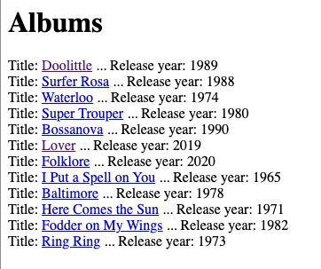
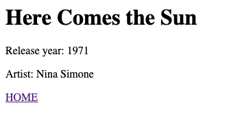

# Music Library Database App

## Description

This is a simple music library database app that allows users to navigate between a list of albums and the individual album pages. Yep, that's it. Nothing more to see here. 
The app is built using Ruby, Sinatra, and PostgreSQL.

## Installation

1. Clone the repository from GitHub.
2. Navigate to the project directory.
3. Install the required gems using `bundle install`.
4. Create the databases for running and testing the app using:
```bash
createdb music_library
createdb music_library_test
```
5. Create the tables with seed data in the databases using the following commands twice:
```bash
psql -h 127.0.0.1 music_library < spec/seeds/albums_seeds.sql
psql -h 127.0.0.1 music_library < spec/seeds/artists_seeds.sql
psql -h 127.0.0.1 music_library_test < spec/seeds/albums_seeds.sql
psql -h 127.0.0.1 music_library_test < spec/seeds/artists_seeds.sql
```
6. Run the app using `rackup`.

## Usage

The app can be used by navigating to `localhost:9292` in a web browser.

This is not a fully developed app, but is an exploration of the Sinatra framework, database management, routes and ERB.

The homepage simply has a link to albums which is really the mainpage of the app and is where any link to HOME will take you.

  

Each album has a link which will navigate to the album's page using :id. On this page you can see the album's most basic details.




